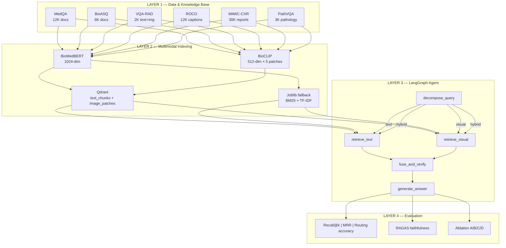
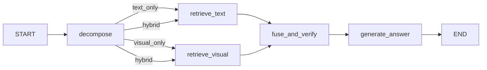

# Architecture — Medical Multimodal RAG Agent

## 4-Layer Architecture



## Agent Graph (LangGraph)



## Dual Pipeline

The project maintains **two pipelines** side by side:

| Pipeline | Class | Index | When to use |
|---|---|---|---|
| Baseline | `MedicalRAGPipeline` | joblib (BM25+TF-IDF) | Ablation, tests, comparison |
| Agent | `AgenticRAGPipeline` | Qdrant (dense multi-vector) | Full system, evaluation target |

Both share `RAGConfig` — toggle with `use_agent`, `use_qdrant`, `use_vlm_generation`.

## Visual Retrieval — 2-Stage Pipeline

```
User image + query
        │
        ▼
  [Stage 1: Coarse]
  BioCLIP encode query (+ blend image 60/40%)
  → Qdrant image_patches search → top-10
        │
        ▼
  [Stage 2: Fine-grained] (optional)
  Qwen2.5-VL ground_region(query, image)
  → crop ROI from each candidate
  → BioCLIP re-encode crops
  → score = 0.5×original + 0.3×confidence + 0.2×similarity
  → top-3 refined results
```

## Data Flow

```
raw JSONL/HF dataset → canonicalize.py → canonical JSONL + manifest.json
                                               │
                                    ┌──────────┼──────────┐
                                    ▼          ▼          ▼
                              data_loaders.py  indexing.py  ingestion/indexer.py
                              (DocumentChunk   (joblib)    (Qdrant)
                               ImageRecord)
```
